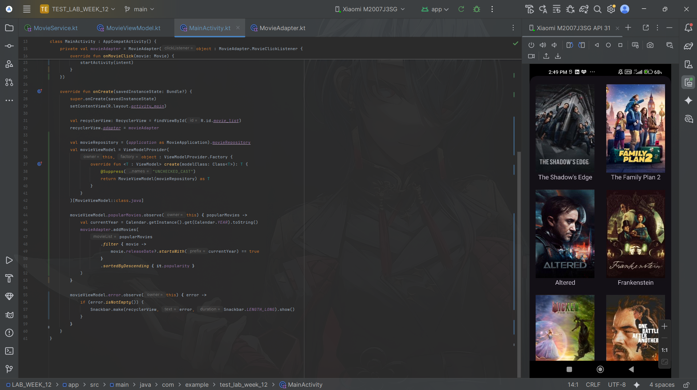
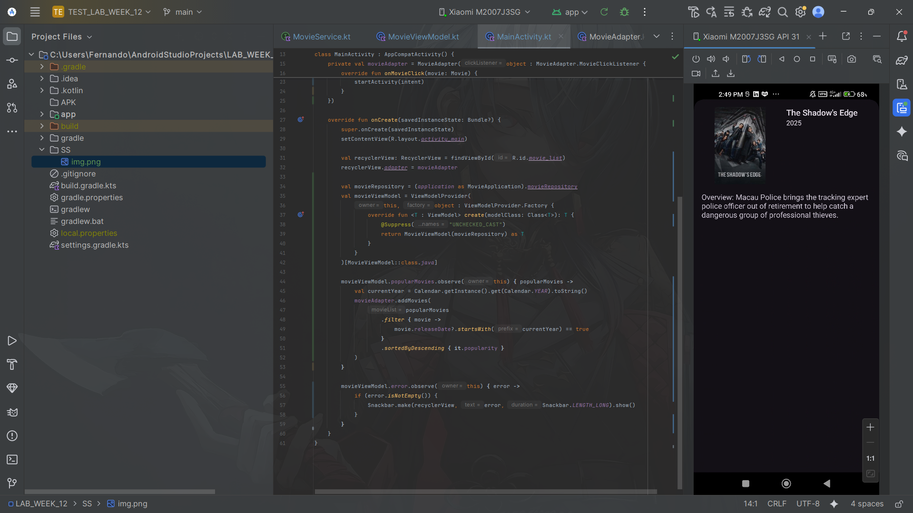
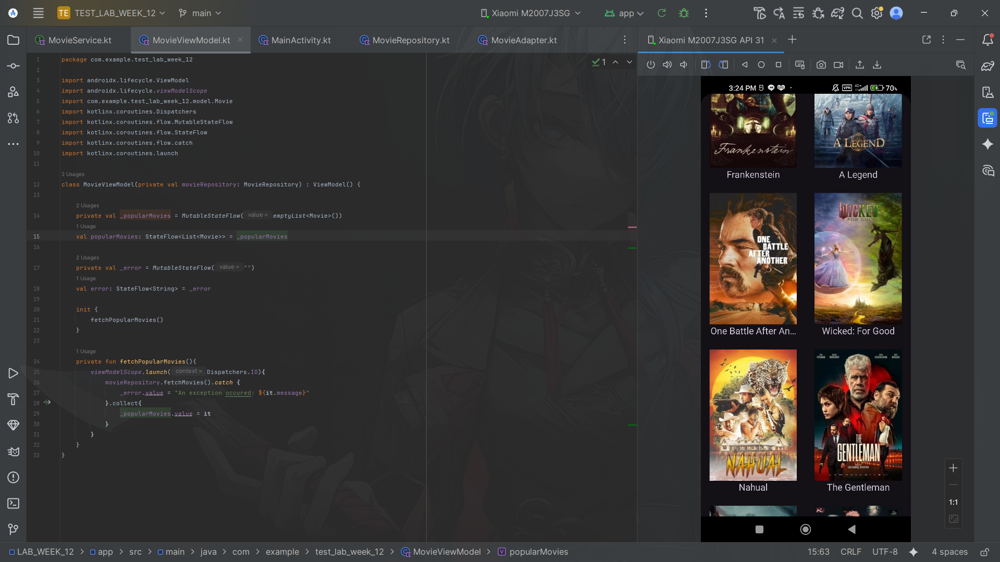
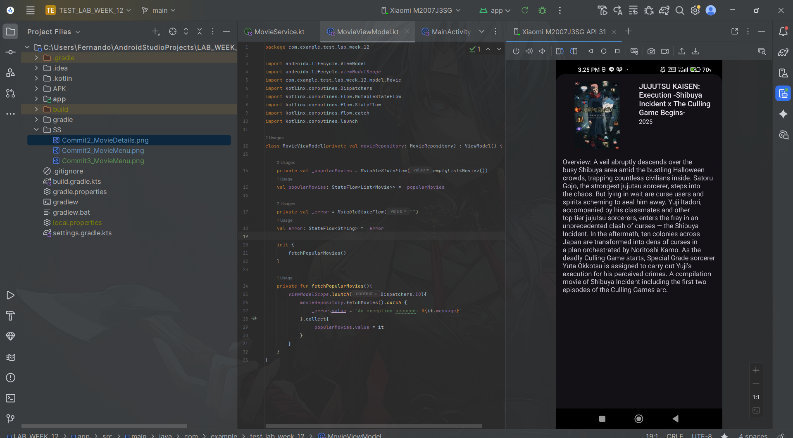

### Submitted by:
* **Nama:** Fernando Sunarto
* **NIM:** 00000083441
* **Class:** AL
---

# LAB_WEEK_12 - Coroutines and Flow

## Project Overview
This project demonstrates the implementation of asynchronous background operations in Android using **Kotlin Coroutines** and **Flow**. The application is a Movie List app that fetches data from the TMDB API, utilizing `suspend` functions for network calls and `StateFlow` for reactive UI updates.

---

### Project Files
| Commit | Description | APK Download | Screenshot Preview |
| :---: |---------------------------------------------|:---:|:---:|
| **02** | **Part 1: Fetching Data with Coroutines (Movie List)** Implemented asynchronous API calls using Coroutines and LiveData. | [📱 Download APK](APK/Commit2.apk) | |
| **02** | **Part 1: Movie Details View** Displaying detailed information passed via Intent. | [📱 Download APK](APK/Commit2.apk) | |
| **03** | **Part 2: Upgrading to Kotlin Flow (Movie List)** Refactored the data layer to use `Flow` and `StateFlow` instead of LiveData. | [📱 Download APK](APK/Commit3.apk) | |
| **03** | **Part 2: Movie Details with Flow** Ensuring UI consistency using Lifecycle-aware coroutine collectors. | [📱 Download APK](APK/Commit3.apk) | |
| **04** | **Assignment: Data Filtering with Flow** Implemented data filtering (descending popularity) directly within the StateFlow pipeline. | [📱 Download APK](APK/Commit4.apk) | |

---
